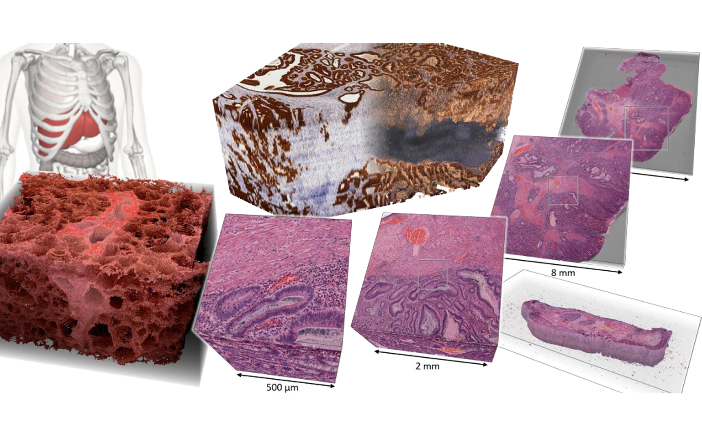
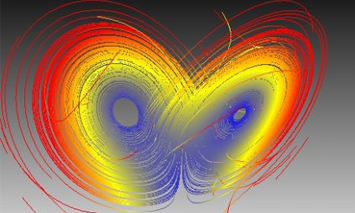

<section id="about" class="about section">
    

        <h2 class="title text-center">What is Inviwo?</h2>
        
Inviwo is a software framework for the rapid prototyping   visualizations. It is written in C++, exploits modern graphics hardware, and is available under   BSD license, which permits free use in any setup - also commercially

        

            

                

                    <i class="fa fa-edit"></i>
                

                

                    <h3 class="sub-title">Rapid prototyping</h3>
                    
Inviwo provides a rich visual interface for the easy creation of custom visualizations. These visualizations can be saved, modified, and reused on other data.

                

                <!--//content-->
            

            <!--//item-->
            

                

                    <i class="fa fa-wrench"></i>
                

                

                    <h3 class="sub-title">Python integration</h3>
                    
Besides being realized in C++, Inviwo exposes a Python 3.7 API, supports Python development, and has Python scripting integrated for batch processing.

                

                <!--//content-->
            

            <!--//item-->
            

            

                

                    <i class="fa fa-arrows-alt"></i>
                

                

                    <h3 class="sub-title">Full extendability</h3>
                    
Inviwo can be extended by implementing own Processors, which can be organized in modules. See our tutorials on creating processors and modules.

                

                <!--//content-->
            

            <!--//item-->
            

            

                

                    <i class="fa fa-cubes"></i>
                

                

                    <h3 class="sub-title">Data types</h3>
                    
Inviwo can read and visualize many data types, such as HD5, DICOM, RAW and TIFF stacks. So you can visualize data from many simulations and imaging modalities.

                

                <!--//content-->
            

            <!--//item-->
            

                

                    <i class="fa fa-book"></i>
                

                

                    <h3 class="sub-title">Documentation</h3>
                    
To get started with Inviwo, we provide guides on how to install, develop new processors, and create new modules. We are currently working on video tutorials.

                

                <!--//content-->
            

            <!--//item-->
            

                

                    <i class="fa fa-users"></i>
                

                

                    <h3 class="sub-title">Community</h3>
                    
Inviwo is used and maintained by researchers at many international universities, core development takes place at Linköping U, Ulm U, and Karolinska U. For help and general discussion join us on our <a href="https://join.slack.com/t/inviwo/shared_invite/enQtNTc2Nzc2NDQwNzIxLTRiMWM1ZWJiYjljZjkwNWE3OTk3MzYxODZlMDUyMzRmZjUzMzBiZjVhNTM3NWUyNzU1MjI4OWJjMzdkODViMzM" rel="nofollow">Slack</a> server.

                

                <!--//content-->
            

            <!--//item-->
        

        <!--//row-->
    

    <!--//container-->
</section>
<section id="showcase" class="carousel section">
    

        <h2 class="title text-center">Gallery</h2>
        

            <ol class="carousel-indicators">
                <li data-target="#showcase" data-slide-to="0" class="active"></li>
                <li data-target="#showcase" data-slide-to="1"></li>
                <li data-target="#showcase" data-slide-to="2"></li>
                <li data-target="#showcase" data-slide-to="3"></li>
                <li data-target="#showcase" data-slide-to="4"></li>
            </ol>
          

            

              
            

            

              
            

            

              
            

            

              
            

            

              
            

          

          <a class="carousel-control-prev left carousel-control" href="#carouselExampleControls" role="button" data-slide="prev" style="background-image: unset;">
            <i class="fa fa-chevron-left"></i>
          </a>
          <a class="carousel-control-next right carousel-control" href="#carouselExampleControls" role="button" data-slide="next" style="background-image: unset;">
            <i class="fa fa-chevron-right"></i>
          </a>
        

    

</section>
<section id="gallery" class="gallery section">
    

        

            <h3>More Features and Information</h3>
            
Check out our <a href="media/inviwo-vcbm2019.pdf">tutorial slides</a> from the 9th EWorkshop on Visual Computing for Biology and Medicine (VCBM2019). We give a brief overview on hoto use Inviwo for rapid prototyping medical applications.

            
Inviwo provides many visualization methods for a range of data types such as triangular meshe images, volumes, vector fields and multidimensional arrays.

            

                

                    

                        
                    

                    <!--//item-->
                    

                        <h4>Geometry</h4>
                        <ul>
                            <li>Mesh rendering</li>
                            <li>Point cloud rendering</li>
                            <li>Line rendering</li>
                            <li>Transparent geometry rendering (using an A-Buffer)</li>
                            <li>Height fields (foto)</li>
                        </ul>
                    

                    <!--//item-->
                

                <!--//row-->
            

            <!--//block-left-->
            

                

                    

                        <h4>Scalar field visualization (Image,&nbsp;Volume)</h4>
                        <ul>
                            <li>GPU-based volume ray-casting with global illumination</li>
                            <li>2D image slice inspection (foto)</li>
                            <li>Contour extraction and visualization (ISO surface )</li>
                        </ul>
                    

                    <!--//item-->
                    

                        
                    

                    <!--//item-->
                

                <!--//row-->
            

            <!--//block-right-->
            

                

                    

                        
                    

                    

                        <h4>Vector field visualization</h4>
                        <ul>
                            <li>Line integral convolution (LIC)</li>
                            <li>Hedgehog</li>
                            <li>Path lines</li>
                            <li>Stream ribbons</li>
                            <li>Stream lines</li>
                        </ul>
                    

                    <!--//item-->
                

                <!--//row-->
            

            <!--//block-left-->
            

                <!-- Modal Content (The Image) -->
                
            

        

        <!--//gallery-inner-->
    

        <!--//container-->
        <!-- The Modal -->
</section>

@Article{inviwo2019,
    author   = {J{\"o}nsson, Daniel and Steneteg, Peter and Sund{\'e}n, Erik and Englund, Rickard and Kottravel, Sathish and Falk, Martin and Ynnerman, Anders and Hotz, Ingrid and Ropinski, Timo},
    title    = {Inviwo - A Visualization System with Usage Abstraction Levels},
    journal  = {IEEE Transactions on Visualization and Computer Graphics},
    year     = {2019},
    doi      = {10.1109/TVCG.2019.2920639},
    ISSN     = {1077-2626},
}

<section id="citation" class="citation section">
    

        

            <h2 class="title text-center">Citation</h2>
            
If you use the Inviwo code for your research, please cite our paper:

            <a href="https://ieeexplore.ieee.org/document/8730513">Inviwo - A Visualization System with Usage Abstraction Levels</a>
            

                <a class="btn btn-cta-primary js-tooltip js-copy"  data-toggle="tooltip" data-placement="top" data-copy="{{bibtex | escape_once }}" title="Copy BibTeX to clipboard."><i class="fa fa-clipboard"></i>COPY</a>
                <pre>
                    <code>{{bibtex}}</code>
                </pre>
            

        

            <!--//funding-inner-->
    

        <!--//container-->
</section>
